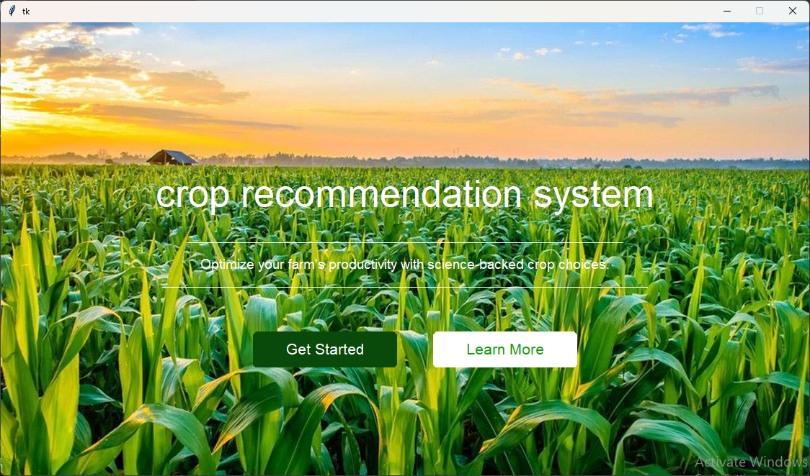

# AI-Powered Crop Recommendation System 🌱



## Overview
An intelligent desktop application that recommends optimal crops based on environmental and soil conditions using advanced search algorithms (Genetic, A*, Greedy, CSP). Designed to help farmers make data-driven decisions for improved agricultural productivity.

## Key Features
- **Multiple Algorithm Support**: Choose between 4 different AI approaches
- **Comprehensive Analysis**: Evaluates 16+ environmental factors
- **Performance Metrics**: Shows suitability scores and match percentages
- **Sustainable Focus**: Prioritizes crops with minimal environmental impact
- **User-Friendly Interface**: Simple Tkinter-based GUI

## Algorithms Implemented
| Algorithm | Best For | Key Advantage |
|-----------|----------|---------------|
| Genetic | Perfect matching | Highest accuracy |
| A* | Balanced recommendations | Best overall performance |
| Greedy | Fast predictions | Quick results |
| CSP | Explainable results | Constraint visualization |

## Installation

### Prerequisites
- Python 3.8+
- pip package manager
- Git (for cloning)

### Step-by-Step Setup

1. **Clone the repository**:
   ```bash
   git clone https://github.com/yourusername/crop-recommendation-system.git
   cd crop-recommendation-system
2. **Create and activate a virtual environment (recommended)**:
   ```bash
   python -m venv venv
   # On Windows:
   venv\Scripts\activate
   # On macOS/Linux:
   source venv/bin/activate
3. **Install dependencies**:
   ```bash
   pip install -r requirements.txt
4. **Run the application**:
   ```bash
   # Start with input form:
    python src/app/frontend/home.py
